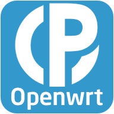
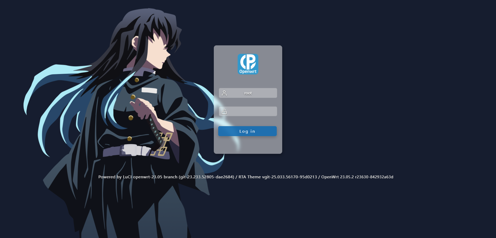
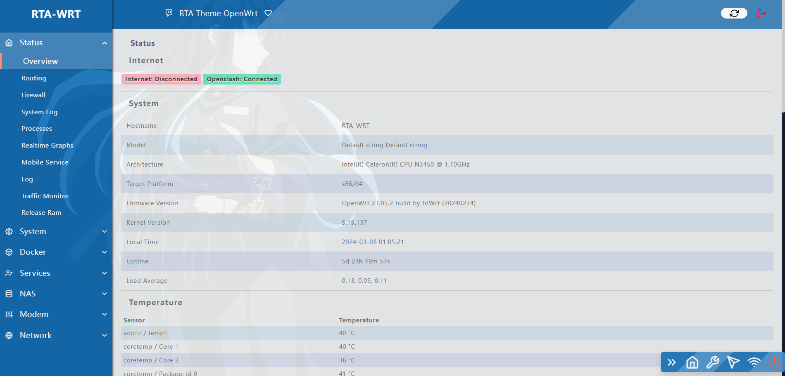
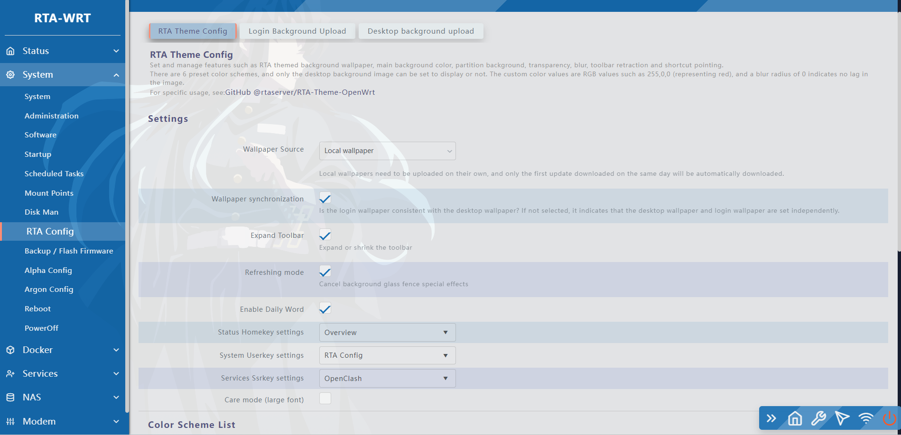

<h1 align="center">
  
   RTA Theme OpenWrt 

</h1>

  

	
    
    
  

  

Based on the Argon and Material Theme

This OpenWRT theme custom is specifically for Version 21.02.5 or Latest

 

* [Apache License 2.0](https://github.com/rtaserver/RTA-Theme-OpenWrt/blob/main/LICENSE)
* [luci-theme-argon](https://github.com/jerrykuku/luci-theme-argon) by [jerrykuku](https://github.com/jerrykuku)
* [luci-theme-material](https://github.com/LuttyYang/luci-theme-material) by [LuttyYang](https://github.com/LuttyYang)
* [kucat](https://github.com/sirpdboy/luci-theme-kucat) by [sirpdboy](hhttps://github.com/sirpdboy)

Preview
---

* Login View

    

* Main View

    

* Config View

    

